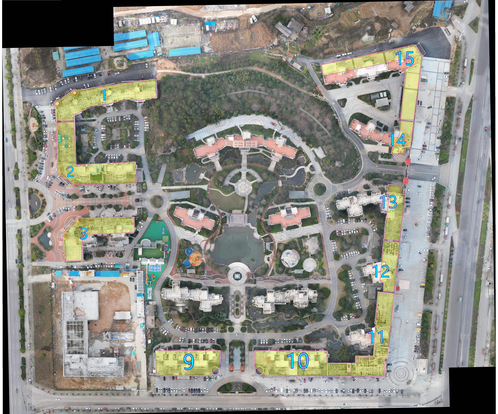
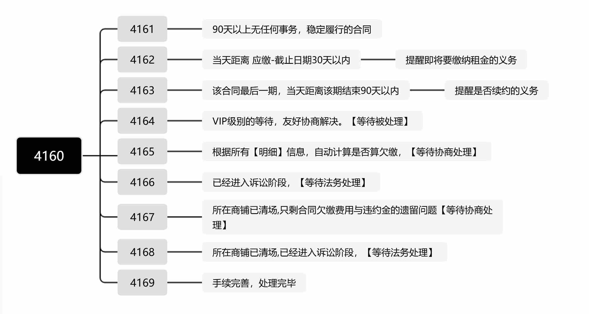

# 银龙房地产-不动产1运营

有的内容需要 账号权限，请联系管理员【注册/授权】

## 不动产管理1 

| 编号    | 关键词   | 功能    | 链接 ::weui:lock-filled =32:: | 状态 | 
|---------------- | --------------- | --------------- | ----|----|
| 4110   | 资料  | 商铺相关文件管理【电子版】【线下档案室】|查看 |::game-icons:light-bulb =32:: |
| 4111   | 资料  |商铺相关文件管理【电子版】【线下档案室】 | 录入 |::game-icons:light-bulb =32:: |
| 4112   | 媒体  | 媒体，广告相关 |点击|::game-icons:light-bulb =32:: |
| 4113   | 信息  | 官方-客户信息管理 |点击|::game-icons:light-bulb =32:: |

## 不动产管理2

| 编号    | 关键词   | 功能    | 链接  ::weui:lock-filled =32::| 状态 |
|---------------- | --------------- | --------------- | ----|----|
| 4120   | 素材  | 商铺广告视频素材 |查看 |::game-icons:light-bulb =32:: |
| 4121   | 素材  | 商铺广告图片素材 | 录入 |::game-icons:light-bulb =32:: |
| 4122   | 资料  | 租赁-俯视图信息 |[点击](https://nocodb.yljt.info/dashboard/#/nc/pteji0a5txq3drk/md8jj6l7su4k4g6)|::noto:light-bulb =32::  |
| 4123   | 资料  | 买卖-俯视图信息 |点击|::game-icons:light-bulb =32:: |
| 4124   | 资料  | 商铺-CAD图 |点击|::game-icons:light-bulb =32:: |
| 4125   | 资料  | 商铺-房产证[商户办理证][灰白水印版本] |点击|::game-icons:light-bulb =32:: |
| 4126   | 资料  | 商铺-测绘报告电子版 |[点击](https://nocodb.yljt.info/dashboard/#/nc/pteji0a5txq3drk/m7vad0vvsh4o7lx)|::noto:light-bulb =32:: |

## 财务相关记录

## 招商经纪人

| 编号    | 关键词   | 功能    | 链接  ::weui:lock-filled =32::| 状态 |
|---------------- | --------------- | --------------- | ----|----|
| 4140   | 表单  | 提交窗口 |查看 |::game-icons:light-bulb =32:: |
| 4141   | 信息  | 经纪人-客户信息管理 | 录入 |::game-icons:light-bulb =32:: |
| 4142   | 信息  | 计算工具(开发中) |点击|::game-icons:light-bulb =32:: |

## 合同运营0 【合同系统-排查问题用】

| 编号    | 关键词    | 排查描述   |相关功能  | 链接  ::weui:lock-filled =32::|状态|
|---------------- | --------------- | ----- |--------------- | ----|--|
| 4150   | 数据排查   | 确认关联的明细是否漏掉  | 合同-查阅明细  |[点击](https://nocodb.yljt.info/dashboard/#/nc/p9j0dgqznz3fpsm/mrz6uw1ju9efh2n/vw06kfx9d7ntpily)|::noto:light-bulb =32:: |
| 4151   | 数据排查  | 每个合同最后一期是否标识 | 合同-到期提醒 |[点击](https://nocodb.yljt.info/dashboard/#/nc/p9j0dgqznz3fpsm/mrz6uw1ju9efh2n/vwb1yjumq4lprz3w)|::noto:light-bulb =32:: |
>

## 合同运营1

<!-- | 4160   | 表单 | 提交信息窗口(密码:8888)->后台审核汇总  |点击|::game-icons:light-bulb =32:: | -->
| 编号    | 关键词    | 功能    | 链接  ::weui:lock-filled =32::| 状态 |
|---------------- | --------------- | -------------- | ----|----|
| 4160    | 信息查询    | 待处理合同   |[点击](https://nocodb.yljt.info/dashboard/#/nc/view/d3d295b4-c15a-49c6-a13d-0096b850358f)|::noto:light-bulb =32:: |
| 4161    | 信息查询    | 已处理合同   |[点击](https://nocodb.yljt.info/dashboard/#/nc/view/846a5015-b60f-4a58-a068-7fa182af4bbf)|::noto:light-bulb =32:: |

<!-- 
| 4161   | 信息查询   | 未归档@1_1履约合同-常规  |[点击](https://nocodb.yljt.info/dashboard/#/nc/p9j0dgqznz3fpsm/mcx6i3z4g1h2kmu/vwyk8cmszjfimc2x)|::noto:light-bulb =32:: |
| 4162   | 信息查询  | 未归档@1_2履约合同-近期待缴租金   |[点击](https://nocodb.yljt.info/dashboard/#/nc/p9j0dgqznz3fpsm/mcx6i3z4g1h2kmu/vw15m7evm0w8n1qe)|::noto:light-bulb =32:: |
| 4163   | 信息查询  | 未归档@1_3履约合同-近期到期(是否续)   |[点击](https://nocodb.yljt.info/dashboard/#/nc/p9j0dgqznz3fpsm/mcx6i3z4g1h2kmu/vw3r8loha0tv0cao)|::noto:light-bulb =32:: |
| 4164   | 信息查询  | 未归档@2_0欠缴合同-保护期(特殊)   |[点击](https://nocodb.yljt.info/dashboard/#/nc/p9j0dgqznz3fpsm/mcx6i3z4g1h2kmu/vwrlnczzqllcnem1)|::noto:light-bulb =32:: |
| 4165   | 信息查询  | 未归档@2_1欠缴合同-协商期   |[点击](https://nocodb.yljt.info/dashboard/#/nc/p9j0dgqznz3fpsm/mcx6i3z4g1h2kmu/vwvybbgej109p1x3)|::noto:light-bulb =32:: |
| 4166   | 信息查询  | 未归档@2_2欠缴合同-涉诉期   |[点击](https://nocodb.yljt.info/dashboard/#/nc/p9j0dgqznz3fpsm/mcx6i3z4g1h2kmu/vwr3p08fzftb08m8)|::noto:light-bulb =32:: |
| 4167   | 信息查询  | 已归档@3-1欠缴合同-协商期   |[点击](https://nocodb.yljt.info/dashboard/#/nc/p9j0dgqznz3fpsm/mcx6i3z4g1h2kmu/vwhqk79lkdx4bd9c)|::noto:light-bulb =32:: |
| 4168   | 信息查询  | 已归档@3-2欠缴合同-涉诉期   |[点击](https://nocodb.yljt.info/dashboard/#/nc/p9j0dgqznz3fpsm/mcx6i3z4g1h2kmu/vwf2xy4lro0lwxjd)|::noto:light-bulb =32:: |
| 4169   | 信息查询  | 已归档@4-*解约合同-手续完善  |[点击](https://nocodb.yljt.info/dashboard/#/nc/p9j0dgqznz3fpsm/mcx6i3z4g1h2kmu/vwmllfn5varffjug)|::noto:light-bulb =32:: |
 -->

## 合同运营2

| 编号    | 关键词    | 功能    | 链接  ::weui:lock-filled =32::|状态|
|---------------- | --------------- | --------------- | ----|--|
| 4170   | 报表   | 不动产单元状态-报告  |点击|::game-icons:light-bulb =32:: |
| 4171   | 报表  | 合同签约近况报表 |点击|::game-icons:light-bulb =32:: |
| 4172   | 报表  | 合同法务报表 |点击|::game-icons:light-bulb =32:: |
| 4173   | 报表 | 合同租金报表【】 |点击|::game-icons:light-bulb =32:: |

## 法务1-围绕合同-签约/解约-资料

| 编号    | 关键词    | 功能    | 链接 ::weui:lock-filled =32::|状态|
|---------------- | --------------- | --------------- | ----|---|
| 4180   | 表单   | 提交信息窗口(密码:8888)->后台审核汇总   |点击| ::game-icons:light-bulb =32:: |
| 4181   | 签约模板  | 商铺-合同模板(个人/公司) |[点击](https://nocodb.yljt.info/dashboard/#/nc/pssn8s7w09znsdj/mu49buplmwsrwoa)| ::noto:light-bulb =32:: |
|  4188   | 签约附件[通用]  | 承诺函 |[点击](https://nocodb.yljt.info/dashboard/#/nc/pdpso6qkpf3750c/m7tlrrg0wutn8in)|::noto:light-bulb =32:: |
| 4189   | 解约模板  | 解除协议模板(个人/公司) |点击|::game-icons:light-bulb =32:: |

## 法务2-入驻后的相关资料
| 编号    | 关键词    | 功能    | 链接 ::weui:lock-filled =32::|状态|
|---------------- | --------------- | --------------- | ----|---|
| 4190   | 表单   | 提交信息窗口(密码:8888)->后台审核汇总   |点击|::game-icons:light-bulb =32:: |
| 4191   | 催缴资料  | 催缴通知书(以后完善) |点击|::game-icons:light-bulb =32:: |

