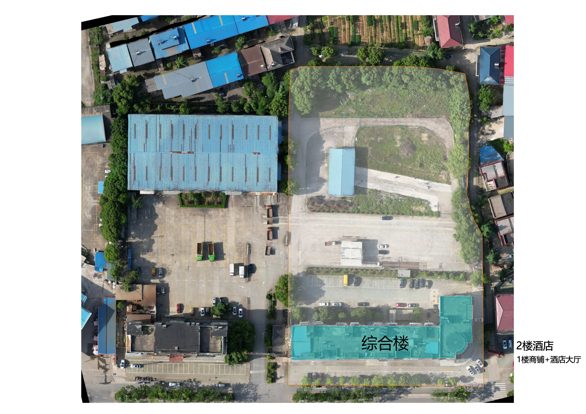

# 银龙管业1-不动产运营

有的内容需要 账号权限，请联系管理员【注册/授权】

## 不动产管理1 

| 编号    | 关键词   | 功能    | 链接 ::weui:lock-filled =32:: | 状态 | 
|---------------- | --------------- | --------------- | ----|----|
| 2110   | 资料  | 商铺相关文件管理【电子版】【线下档案室】|查看 |未上线|
| 2111   | 资料  |商铺相关文件管理【电子版】【线下档案室】 | 录入 |未上线|
| 2112   | 媒体  | 媒体，广告相关 |点击|未上线|
| 2113   | 信息  | 官方-客户信息管理 |点击|未上线|

## 不动产管理2

| 编号    | 关键词   | 功能    | 链接  ::weui:lock-filled =32::| 状态 |
|---------------- | --------------- | --------------- | ----|----|
| 2120   | 素材  | 商铺广告视频素材 |查看 |未上线|
| 2121   | 素材  | 商铺广告图片素材 | 录入 |未上线|
| 2122   | 资料  | 租赁-俯视图信息 |点击|未上线|
| 2123   | 资料  | 买卖-俯视图信息 |点击|未上线|
| 2124   | 资料  | 商铺-CAD图 |点击|未上线|
| 2125   | 资料  | 商铺-房产证[商户办理证][灰白水印版本] |点击|未上线|
| 2126   | 资料  | 商铺-测绘报告电子版 |点击|未上线|

## 招商经纪人

| 编号    | 关键词   | 功能    | 链接  ::weui:lock-filled =32::| 状态 |
|---------------- | --------------- | --------------- | ----|----|
| 2150   | 表单  | 提交窗口 |查看 |未上线|
| 2151   | 信息  | 经纪人-客户信息管理 | 录入 |未上线|
| 2152   | 信息  | 计算工具(开发中) |点击|未上线|

## 合同运营1

| 编号    | 关键词    | 功能    | 链接  ::weui:lock-filled =32::| 状态 |
|---------------- | --------------- | --------------- | ----|----|
| 2160   | 表单 | 提交信息窗口(密码:8888)->后台审核汇总  |点击|
| 2161    | 信息查询    | 查看租赁合同(所有)   |[点击](https://nocodb.yljt.info/dashboard/#/nc/p9j0dgqznz3fpsm/mcx6i3z4g1h2kmu/vwfwbaek32ypvyj1)|
| 2162   | 信息查询   | 查看租赁合同(欠缴)  |点击|
| 2163   | 信息查询  | 租赁合同法务(欠缴)   |点击|

## 合同运营2

| 编号    | 关键词    | 功能    | 链接  ::weui:lock-filled =32::|
|---------------- | --------------- | --------------- | ----|
| 2170   | 报表   | 不动产单元状态-报告  |点击|
| 2171   | 报表  | 合同签约近况报表 |点击|
| 2172   | 报表  | 合同法务报表 |点击|
| 2173   | 报表 | 合同租金报表【】 |点击|

## 法务1-围绕合同-签约/解约-资料

| 编号    | 关键词    | 功能    | 链接 ::weui:lock-filled =32::|状态|
|---------------- | --------------- | --------------- | ----|---|
| 2180   | 表单   | 提交信息窗口(密码:8888)->后台审核汇总   |点击| ::game-icons:light-bulb =32:: |
| 2181   | 签约模板  | 茅草右侧商铺合同模板(个人/公司(缺少)) |[点击](https://nocodb.yljt.info/dashboard/#/nc/pxkknbwbznauyr4/mfqqhg7yl52sgtg)| ::noto:light-bulb =32:: |
|  2188   | 签约附件[通用]  | 承诺函 |[点击](https://nocodb.yljt.info/dashboard/#/nc/pdpso6qkpf3750c/m7tlrrg0wutn8in)|::noto:light-bulb =32:: |
| 2189   | 解约模板  | 解除协议模板(个人/公司) |点击| ::game-icons:light-bulb =32:: |

## 法务2-入驻后的相关资料
| 编号    | 关键词    | 功能    | 链接 ::weui:lock-filled =32::|状态|
|---------------- | --------------- | --------------- | ----|---|
| 2190   | 表单   | 提交信息窗口(密码:8888)->后台审核汇总   |点击|::game-icons:light-bulb =32:: |
| 2191   | 催缴资料  | 催缴通知书(以后完善) |点击|::game-icons:light-bulb =32:: |